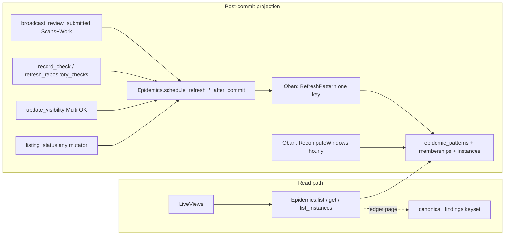
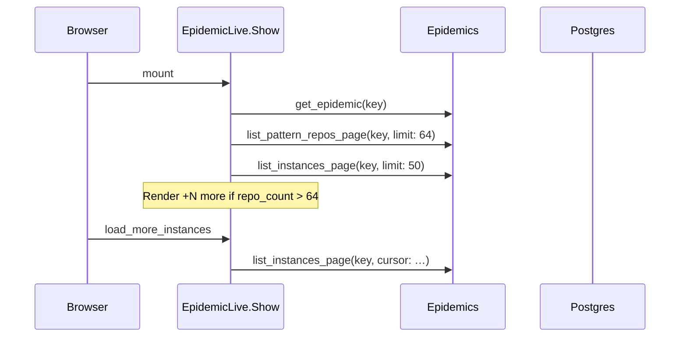
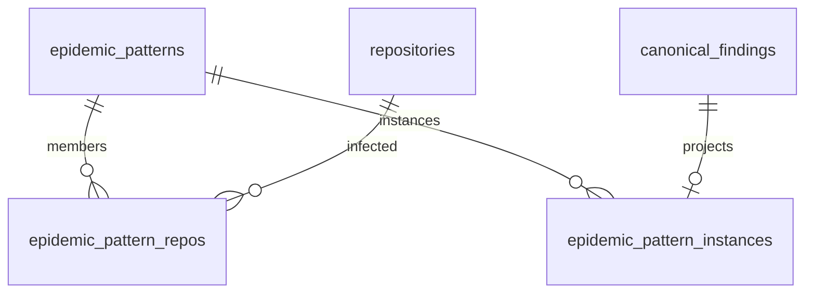
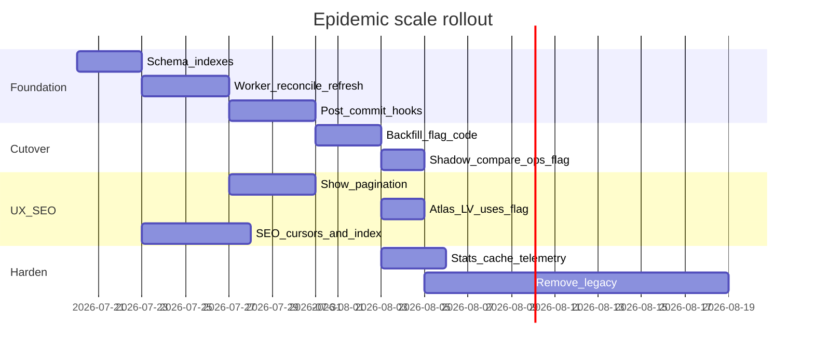

# Scale Redesign: Epidemic Map & Multi-Million Repository Registry

| Field | Value |
|-------|-------|
| **Document** | Scale redesign — epidemic map and registry |
| **Author** | TBD |
| **Date** | 2026-07-18 |
| **Status** | Approved for implementation (rev 3 + product answers) |
| **App** | Tarakan / TarakanWeb |
| **Stack** | Phoenix LiveView · Ecto · Postgres · Oban |

---

## Overview

Tarakan’s epidemic / contagion surface (`Epidemics`, constellation map, hub-spoke graph) and public registry lists were built for demo scale (~12 listed repos, ~20 patterns). At that size, online multi-join `GROUP BY` aggregation and unbounded `Repo.all()` lists are fine. Growth toward large listed registries and dense public findings makes those paths the binding constraints on page latency, DB CPU, and LiveView memory.

This design keeps the product voice—a **public disclosure registry** with a **top-patterns contagion atlas**, not a generic scanner SaaS or a full-mesh graph of every repo—and makes the **epidemic atlas/list/show read path** and **paginated registry/SEO surfaces** credible on the **current stack** (single Postgres primary + Phoenix + Oban). The core move is **pre-aggregated epidemic rollups updated asynchronously after commits (Oban)**, with **windowed counters that preserve today’s list semantics**, **cursor pagination** for registry/SEO/instance ledgers, **read-shaped indexes**, and **bounded LiveView assigns/streams**.

**Scale honesty:** this phase **proves** atlas/list/show and cursor-paginated registry reads; multi-million *listed* is a **target tier** with named prerequisites (pre-ranked window columns, multi-file sitemap, complete write hooks, home collective debouncing). Sharding, multi-region, and full CQRS event stores remain out of scope.

This design uses **async projection writes + dual-read** (legacy vs rollup). It is **not** dual-write of business facts (`canonical_findings` / scans remain source of truth).

---

## Background & Motivation

### Product surface today

| Concept | Location | Role |
|---------|----------|------|
| Pattern key | `FindingMemory.pattern_key/1` | SHA256 of aggressively normalized title; cross-repo class key |
| Exact fingerprint | `FindingMemory.fingerprint/1` | Per-repo path+lines+title; auto-links occurrences |
| Canonical findings | `canonical_findings` | Repo-level issue memory + status quorum |
| Epidemics context | `lib/tarakan/epidemics.ex` | Online SQL aggregation for map + show |
| Contagion UI | `lib/tarakan_web/components/epidemic_components.ex` | SVG constellation (top N) + hub-spoke graph |
| LiveViews | `EpidemicLive.Index/Show`, home (`RepositoryLive.Index`), `ExploreLive` | Consume epidemics on mount / activity refresh |

### Current epidemic read path (hot)

`Epidemics.list_epidemics/1` joins:

`canonical_findings` ⋈ `repositories` ⋈ `scan_findings` ⋈ `scans`

filters listed + **full** `scan.visibility == "public"` (not `public_summary`) + non-null `pattern_key` + **`canonical.updated_at >= since` before aggregate**, optional `maybe_status/2` on the pre-aggregate set, then `GROUP BY pattern_key` with **distinct** repo/instance counts and status filters, `HAVING` min repos, `ORDER BY` repo_count / last_seen, `LIMIT` ≤ 100. A second query (`representative_titles/1`) picks display title/severity/sample path per key (today left-joins occurrences **without** visibility filter—fixed in rollup recompute).

Call sites:

- Home: limit 12, days 30 (`RepositoryLive.Index`)
- Explore: limit 5 (`ExploreLive`)
- `/epidemics`: limit 50 + filter form (`EpidemicLive.Index`; days ∈ {7,30,90,365})
- Seeds / tests

`get_epidemic/1` and `list_instances/2` re-run similar joins (instances default limit 100, max 300; return a **list**).

### Write path already materializes *repo* metrics

`FindingMemory.assimilate_scan/1` upserts canonicals and refreshes per-canonical counters. Public API `Scans.recalculate_repository_metrics/1` (private `recalculate_repository/2`) maintains `repositories.open_findings_count`, `verified_findings_count`, `scan_count`, listing promotion `pending → listed`. **There is no analogous materialization for pattern-level epidemic stats.**

### Proven ops patterns to reuse

- **Oban workers** with uniqueness and batched cursor sweeps: `Tarakan.Sync.RepositorySweep` / `RepositorySweepBatch`.
- **Nightly cron** via `Oban.Plugins.Cron` in `config/config.exs` (`RepositorySweep` 03:00, `HostedRepositoryGC` weekly).
- **LiveView streams** on explore wire, moderation queue, admin accounts—not yet epidemic instance ledgers.
- **Bounded search**: `Repositories.search_repositories/2` limits 1–50; contrast unbounded `list_listed_repositories/0` and `Scans.list_indexable_findings/0` used by `SEOController.sitemap/2`.
- **Post-commit side effects**: `broadcast_review_submitted/1` after `do_submit_scan` Multi success **and** Work task submit Multi success; moderation broadcasts after `moderate_scan` transaction.

### Pain points as scale grows

| Bottleneck | Symptom |
|------------|---------|
| Online epidemic aggregation | Multi-second group-bys as canonical/occurrence tables grow |
| Unbounded registry / findings lists | Sitemap OOM or multi-minute responses |
| LiveView assigns | Large instance lists; home re-queries epidemics + collective payload on every activity |
| Missing composite indexes | Window + listing filters cannot be index-only |
| Incomplete projections without hooks | Visibility/listing flips leave stale public contagion until reconcile |

---

## Goals & Non-Goals

### Goals

1. **Atlas/list/show read path p95 under ~100ms DB time** once rollups are warm and hooks are live, at **Tier B–C** scale (see Scale tiers)—not a blanket claim that every subsystem is multi-million-ready.
2. **Preserve production epidemic list semantics** (in-window canonical rows before aggregate; listed + full public only; distinct counts) when window columns are fresh, with **documented window-exit lag ≤ ~1h** (hourly recompute + last_seen guard)—not bit-identical live `since` without that maintenance.
3. **Correct public contagion**: only listed repos + `visibility == "public"` occurrences; quarantine, delist, and visibility takedowns remove contribution after refresh (delist-safe key discovery; no waiting for nightly reconcile for correctness).
4. **Async projection maintenance** after commits (not on page load), covering every path that changes the public join set.
5. **Cursor pagination** for listed repositories, epidemic instance ledgers, indexable findings, and sitemap generation; multi-file sitemap before multi-million SEO claims.
6. **Bounded LiveView memory**: top-N atlas; capped graph satellites; streamed/paginated ledger.
7. **Indexes aligned to read and refresh predicates**.
8. **Incremental ship plan** with hard cutover gates (hooks → backfill → shadow-compare → flag).
9. Preserve product framing: **public disclosure registry** and **top patterns atlas**.

### Non-Goals

- Graph of all repositories or all findings.
- Cross-region multi-primary, Citus/sharding, or Kafka CQRS.
- Changing `pattern_key` or fingerprint definitions.
- Real-time epidemic map animation beyond current SVG chrome.
- Sub-second global consistency under write storms (seconds of lag OK if bounded and measured).
- Making home LiveView multi-million *activity-rate* ready in this phase (collective payload debouncing is partial; full home scale is follow-up).
- Replacing Oban.

### Scale tiers (honest capacity)

| Tier | Listed repos (order) | What this design makes solid | Still aspirational / follow-up |
|------|----------------------|------------------------------|--------------------------------|
| **A — near-term** | ~10³–10⁴ | Rollups + hooks + cursors; single-file sitemap streaming | — |
| **B — growth** | ~10⁴–10⁵ | Pre-ranked window columns; multi-file sitemap (≥ **20k listed** hard gate); stats ETS | Home activity fan-out; contributor count |
| **C — multi-million listed** | ~10⁶ | Atlas/list/show from `epidemic_patterns` indexes only; membership/instance tables for show/refresh | Write amplification on super-hot patterns; full-fleet reconcile duration; home PubSub; possible dirty-keys drain |

Capacity sketch (order-of-magnitude, not a promise):

| Object | Bound assumption | Storage class |
|--------|------------------|---------------|
| Distinct `pattern_key`s | ≪ canonicals (title collapse); plan for 10⁵–10⁶ worst case | `epidemic_patterns` ~100–300 B/row → tens–hundreds MB |
| Memberships (`pattern × listed repo`) | product of multi-repo patterns; dense epidemics dominate | 10⁷ rows → few GB with indexes |
| Instance grain (`pattern × canonical`) | ≤ public canonicals with pattern_key | same order as public canonical subset |
| Refresh rate | one Oban job per key, unique 30s coalesce | hot keys refresh at most ~2/min each |

---

## Proposed Design

### Architecture (read vs write)



### Design principles

1. **Preserve list semantics** via **precomputed fixed-window counters** on `epidemic_patterns` (UI windows are only 7/30/90/365), with **explicit window-decay maintenance** so quiet patterns age out without writes.
2. **Materialize membership + instance grain** for show/graph/refresh—not for fleet-wide list `GROUP BY`.
3. **Prefer async refresh after commit** so assimilate Multi latency is unchanged.
4. **One Oban job per `pattern_key`** for uniqueness/coalescing.
5. **Periodic chained reconcile** ships with the worker—not as a late nice-to-have.
6. **Atlas ≠ universe**.
7. **Delist-safe key discovery** always consults existing rollup memberships (not only the live listed join).

---

### Target semantics (frozen)

**Decision: preserve today’s `list_epidemics/1` semantics.** Not an intentional product change.

Production rules (from `lib/tarakan/epidemics.ex`):

1. Include a canonical only if:
   - `repository.listing_status == "listed"`
   - exists a linked `scan_findings` row whose parent scan has `visibility == "public"`
   - `pattern_key` present and non-empty
   - **`canonical.updated_at >= since`** (window applied **before** `GROUP BY`)
2. Optional `status` filter further restricts the **pre-aggregate** set (`maybe_status/2`).
3. Aggregates use **`count(distinct repository_id)`** and **`count(distinct canonical.id)`** (and status-filtered distincts).
4. Order: `repo_count DESC`, then `max(updated_at) DESC`; `HAVING repo_count >= min_repos`; limit capped.

**Implication for rollups:** membership `last_seen_at` alone is **not** sufficient for list ranking. Online `GROUP BY` on `epidemic_pattern_repos` in a dense window is also **not** the multi-million list strategy.

**Implementation that matches:**

- On each `refresh_pattern!/1`, compute for each standard window `W ∈ {7, 30, 90, 365}` the exact aggregates as if `list_epidemics(days: W)` for **status-unfiltered** path, and store them on `epidemic_patterns`.
- `list_epidemics` maps `days` to the nearest supported window (UI only offers these four; **exact match** for 7/30/90/365; for other values use smallest W ≥ days and document).
- Status filter (`status in open|verified|…`): **secondary path** using `epidemic_pattern_instances` filtered by `status` and **live** `updated_at >= since` with distinct aggregates (always clock-correct; table is much smaller than full CF⋈occurrence⋈scan join). Main UI does not pass status today; still implement correctly for API parity.

#### Window-decay consistency (clock lag is first-class)

Precomputed `*_Wd` columns are snapshots of “in-window at `refresh_pattern!` time.” Production evaluates `since = now() - days` **on every read**. Quiet patterns (no assimilate/check/listing event) would otherwise remain on the atlas until nightly reconcile—**up to ~24h**—which is larger than write-lag budget and breaks bit-identical dual-read at time edges.

**Chosen strategy: (1) cheap window recompute + (2) read-path last_seen guard.**

| Mechanism | What it does | Cadence / cost |
|-----------|--------------|----------------|
| **A. `Epidemics.RecomputeWindows` Oban job** | For each pattern (cursor), recompute **only** window columns from `epidemic_pattern_instances` using `updated_at >= now() - W` — **no** CF⋈scan join; also updates membership `last_seen` aggregates if derived from instances | **Hourly** chained cursor (crontab `0 * * * *`); concurrency 1; budget N keys/run then re-enqueue |
| **B. Read-path guard** | Default list always adds `last_seen_at_Wd >= since` (or `IS NOT NULL` equivalent) so patterns whose **newest** in-window instance has fully exited cannot rank even if stale columns say otherwise | O(1) index filter on every list |
| **C. Partial multi-repo decay** | When one of several repos ages out mid-window, rank `repo_count_Wd` can stay high until A runs — **accepted lag ≤ ~1h** (not 24h). Documented; dual-read parity tests use `freeze_time` / compare within lag or force `RecomputeWindows` / `refresh_pattern!` before assert | Hourly A heals partial decay |

**Do not claim bit-identical live `since` without A+B.** Goals wording:

- **Semantic target:** same as production when window columns are fresh (after refresh or hourly recompute).
- **Bounded clock lag:** write-path lag p95 &lt; 30s / p99 &lt; 2m; **window-exit / partial-decay lag p95 ≤ 1h** (hourly job), p99 until next reconcile if job backlog.
- Status-filtered secondary path uses **live** instance `updated_at` and has **no** window-column lag.

**Tests:** dual-read parity for status-unfiltered 7/30/90/365 after refresh/recompute; explicit fixture where an instance ages past `since` and disappears from list after `RecomputeWindows` (and is excluded by guard when `last_seen_at_Wd` is null/old). Not “parity of a weakened v1.1.”

**Product decision (resolved):** fixed-only patterns **remain on the atlas** when in-window — same as today. No special exclusion of `status == "fixed"`.

---

### Data model

#### Table: `epidemic_patterns`

One row per `pattern_key` with ≥1 listed+public instance. **When none remain: hard-delete the rollup row** (and related memberships/instances for that key); show page 404s. No soft-delete retention.

| Column | Type | Notes |
|--------|------|-------|
| `pattern_key` | `string(64)` PK | |
| `title` | `string` not null | Representative (open-preferring, newest) among **public** occurrences |
| `severity` | `string` nullable | |
| `sample_file_path` | `string` nullable | |
| `sample_occurrence_public_id` | `uuid` nullable | **Must** be a public scan occurrence |
| `repo_count` | `integer` | All-time listed+public distinct repos |
| `instance_count` | `integer` | All-time distinct canonicals |
| `open_count` … `disputed_count` | integers | All-time status tallies (show page / chips) |
| `first_seen_at` / `last_seen_at` | `utc_datetime_usec` | All-time among counted |
| **`repo_count_7d` … `repo_count_365d`** | integers | In-window distinct repos (exact semantics) |
| **`instance_count_7d` … `_365d`** | integers | In-window distinct canonicals |
| **`open_count_7d` …`** (and verified/fixed/disputed × windows) | integers | In-window status tallies for chips on list cards |
| **`last_seen_at_7d` … `_365d`** | `utc_datetime_usec` nullable | `max(updated_at)` in window; null if empty |
| `refreshed_at` | `utc_datetime_usec` not null | Last successful recompute |
| timestamps | | |

No `stats_version` column in v1 (lost updates are acceptable: last writer wins on full recompute from source; concurrent jobs for the same key are coalesced by Oban unique).

**Indexes (pre-ranked atlas — O(limit) reads)**

```text
CREATE INDEX epidemic_patterns_rank_30d_idx
  ON epidemic_patterns (repo_count_30d DESC, last_seen_at_30d DESC NULLS LAST)
  WHERE repo_count_30d >= 2;

-- same pattern for 7d, 90d, 365d
CREATE INDEX epidemic_patterns_rank_7d_idx
  ON epidemic_patterns (repo_count_7d DESC, last_seen_at_7d DESC NULLS LAST)
  WHERE repo_count_7d >= 2;
-- … 90d, 365d …
```

#### Table: `epidemic_pattern_repos`

Per-pattern, per-repository membership (show graph satellites; listing fan-in).

| Column | Type | Notes |
|--------|------|-------|
| `pattern_key` | `string(64)` | PK part |
| `repository_id` | `bigint` FK CASCADE | PK part |
| `instance_count` | integer | Distinct canonicals in repo |
| `open_count` … `disputed_count` | integers | |
| `primary_status` | string | open > disputed > verified > fixed |
| `severity` / `title` | | |
| `sample_occurrence_public_id` | uuid nullable | Public only |
| `first_seen_at` / `last_seen_at` | | |
| timestamps | | |

```text
PRIMARY KEY (pattern_key, repository_id)
CREATE INDEX epidemic_pattern_repos_repo_idx ON epidemic_pattern_repos (repository_id);
CREATE INDEX epidemic_pattern_repos_pattern_recent_idx
  ON epidemic_pattern_repos (pattern_key, last_seen_at DESC, repository_id DESC);
```

#### Table: `epidemic_pattern_instances`

Canonical grain for exact window/status recompute, hourly window decay, and status-filtered lists.

| Column | Type | Notes |
|--------|------|-------|
| `pattern_key` | `string(64)` not null | Denormalized for window indexes |
| `canonical_finding_id` | `bigint` PK | FK → `canonical_findings(id)` **ON DELETE CASCADE** |
| `repository_id` | `bigint` not null | FK → `repositories(id)` **ON DELETE CASCADE** (denormalized; matches canonical.repository_id) |
| `status` | `string` not null | |
| `severity` | string nullable | |
| `title` | string | |
| `file_path` | string nullable | |
| `sample_occurrence_public_id` | uuid nullable | Newest **public** occurrence for this canonical |
| `inserted_at` | utc_datetime_usec | canonical.inserted_at |
| `updated_at` | utc_datetime_usec | canonical.updated_at (drives window) |

```text
PRIMARY KEY (canonical_finding_id)
FOREIGN KEY (canonical_finding_id) REFERENCES canonical_findings(id) ON DELETE CASCADE
FOREIGN KEY (repository_id) REFERENCES repositories(id) ON DELETE CASCADE
CREATE UNIQUE INDEX ON epidemic_pattern_instances (pattern_key, canonical_finding_id);
CREATE INDEX epidemic_pattern_instances_window_idx
  ON epidemic_pattern_instances (pattern_key, updated_at DESC);
CREATE INDEX epidemic_pattern_instances_status_window_idx
  ON epidemic_pattern_instances (status, updated_at DESC, pattern_key);
CREATE INDEX epidemic_pattern_instances_repo_idx
  ON epidemic_pattern_instances (repository_id);
```

Refresh rebuilds instance rows for a pattern from the public join, then derives repos + pattern window columns from **this table** (no multi-occurrence inflation).

**Delete cleanup:** Hosted or hard-deleted repositories remove `repositories` rows; existing app FKs delete/cascade canonicals; instance + membership projections **CASCADE** clear without enqueue. Empty `epidemic_patterns` rows (no remaining instances) are removed by the next `refresh_pattern!` of related keys, hourly `RecomputeWindows` (when instance count becomes 0), or nightly reconcile. No explicit delist enqueue is required for hard DELETE—only for soft listing flips (quarantine/pending) that leave the repository row intact.

#### Dirty-keys table (optional, threshold-gated)

**Not** in v1 schema. Promote only if metrics show:

- Oban `epidemics` insert rate &gt; 500/s sustained, **or**
- unique-job discard rate high while refresh lag &gt; 2m for hot keys

Then: `epidemic_dirty_keys(pattern_key PK, enqueued_at, reason)` drained by a single worker with `DELETE … RETURNING` batches of 100–500. Until then: **one Oban job per key** only.

#### Schema modules

```elixir
# lib/tarakan/epidemics/pattern.ex
# lib/tarakan/epidemics/pattern_repo.ex
# lib/tarakan/epidemics/pattern_instance.ex
```

Context API stays on `Tarakan.Epidemics`.

---

### Supporting indexes on source tables

```sql
CREATE INDEX canonical_findings_pattern_repo_idx
  ON canonical_findings (pattern_key, repository_id)
  WHERE pattern_key IS NOT NULL AND pattern_key <> '';

CREATE INDEX canonical_findings_pattern_status_idx
  ON canonical_findings (pattern_key, status)
  WHERE pattern_key IS NOT NULL AND pattern_key <> '';

CREATE INDEX canonical_findings_pattern_updated_idx
  ON canonical_findings (pattern_key, updated_at DESC)
  WHERE pattern_key IS NOT NULL AND pattern_key <> '';

CREATE INDEX repositories_listed_id_idx
  ON repositories (id)
  WHERE listing_status = 'listed';

CREATE INDEX scans_public_repo_idx
  ON scans (repository_id, id)
  WHERE visibility = 'public';
```

Partial predicates must match Ecto (`is_nil` / `!= ""` → SQL `IS NOT NULL AND <> ''`).

#### Zero-downtime index / migration ops

Deploy path today: Docker image via `scripts/deploy/deploy.sh` → `docker compose up`; app container migrates then serves (`deploy/docker/compose.yml`: migrate then server via release).

**Pool sizing (authoritative for deploy):**

| Source | Default `POOL_SIZE` |
|--------|---------------------|
| `config/runtime.exs` | `10` if env unset |
| **`deploy/docker/compose.yml` production** | **`POOL_SIZE:-5`** (“minimum 2 GB deployment”) — **this is the deploy default** |

Size Oban against **compose default 5**, not runtime’s 10:

| Queue | Concurrency | Notes |
|-------|-------------|-------|
| `sync` | 5 | Existing |
| `mirror` | 3 | Existing — already can saturate a pool of 5 under sweep+mirror; known pressure |
| `epidemics` | **1** (v1) | Raise to 2 only if `POOL_SIZE ≥ 10`; to 3 only if `POOL_SIZE ≥ 15` |
| web/LiveView | needs residual connections | Prefer `POOL_SIZE ≥ 15` when epidemics workers are enabled in prod |

Document in ops: enabling epidemics workers ⇒ set `POOL_SIZE=15` (or higher) in `.env`. Design claim is **not** “sync+mirror+epidemics ≤ 10 by default.”

| Step | Guidance |
|------|----------|
| Small tables (empty rollups) | Normal `mix ecto.migrate` / `Tarakan.Release.migrate` in deploy is fine |
| Large concurrent indexes on hot `canonical_findings` | Prefer **separate migration** with `disable_ddl_transaction: true` and `CREATE INDEX CONCURRENTLY`; run in a maintenance window if table is already huge; app **can** deploy with rollup tables present and indexes still building—refresh is slower but correct |
| Lock monitoring | Watch `pg_stat_activity` / `pg_locks` during concurrent builds; avoid stacking multiple concurrent index builds |
| Incomplete indexes | Feature flag stays off until backfill + indexes valid (`pg_index.indisvalid`) |
| Pool vs Oban | Start `epidemics: 1`; raise only with documented `POOL_SIZE` |

---

### Write-path hooks

#### Mutate-path matrix (public join set)

Any path that can attach/detach listed+public contribution **or** change canonical status contributing to rollups **must** schedule refresh after successful **commit**.

| Event | Code location | Keys | Reason |
|-------|---------------|------|--------|
| Review submit (Scans) | `Scans.do_submit_scan/4` Multi **success** (with `broadcast_review_submitted/1`) | Scan-scoped pattern_keys; **plus** repository-scoped **only if** `listing_status` changed in Multi | `:assimilate` / `:listing_change` |
| Review submit (Work / jobs) | `Tarakan.Work` contribution submit Multi success that calls `Scans.stage_review_insert/1` then `Scans.broadcast_review_submitted/1` (~work.ex submit path) — **not** only `do_submit_scan` | Same as Scans submit | `:assimilate` / `:listing_change` |
| Other assimilate | Seeds or any post-commit caller of `FindingMemory.assimilate_scan/1` outside a Multi | Returned pattern_keys | `:assimilate` |
| Finding check | `FindingMemory.record_check/4` **after** transaction success (status/counts changed) | That canonical’s `pattern_key` | `:status` |
| Report-level check | Confirmation Multi in `Scans` that runs `assimilate_report_check/3` **inside** Multi (`:finding_checks` step) — schedule on Multi **success branch only**, never inside `assimilate_report_check` | Touched keys from return value or scan | `:status` |
| Authority revalidate | `Scans.revalidate_repository_authority/1` → `FindingMemory.refresh_repository_checks/1` (membership / platform role changes via `Repositories.notify_membership_authorization_change`) | Distinct pattern_keys of canonicals in repo whose status/counts may have flipped (or repository-scoped refresh) | `:status` |
| Visibility change | `Scans.update_visibility/4` → `moderate_scan/4` Multi OK when visibility changed | Scan-scoped keys | `:visibility` |
| Listing via recalculate | Multi success when private `recalculate_repository/2` changed `listing_status` (`do_submit_scan`, `moderate_scan`) | **Delist-safe** repository key discovery (below) | `:listing_change` |
| Explicit listing | `Repositories.update_listing_status/3` after successful update | Delist-safe repository keys | `:listing_change` |
| Work publish promotion | `Work.promote_pending_repository!/2` (from `publish_task/3`) pending→listed — **outside** `update_listing_status/3` and outside `recalculate_repository/2` | Delist-safe repository keys | `:listing_change` |
| Hosted / moderation listing | Any other writer of `listing_status` | Delist-safe repository keys | `:listing_change` |
| Hourly window decay | `Epidemics.RecomputeWindows` | Cursor over patterns | `:window_decay` |
| Reconcile / backfill | Workers | Key set | `:reconcile` / `:backfill` |

**Centralization preference:** implement scan-scoped scheduling once next to every post-commit `broadcast_review_submitted/1` (Scans + Work), so new submit entrypoints cannot forget assimilate hooks. Listing: one helper `schedule_refresh_for_repository_after_commit/2` called from **every** `listing_status` mutator.

**Not sufficient alone:** tail of `assimilate_scan/1` or body of `assimilate_report_check/3` (both may run inside Multi). Mid-transaction Oban insert is forbidden.

#### Delist-safe repository key discovery

After `listed → quarantined|pending` (or reverse), key discovery **must not** require `listing_status == "listed"` on the live join—that returns **zero keys** post-delist and leaves stale memberships until reconcile.

```elixir
@doc """
Union of (1) keys already projected for this repo and (2) keys still present
on public occurrences ignoring listing_status. Recompute applies listed+public.
"""
defp pattern_keys_for_repository(repository_id) do
  from_rollup =
    from(m in PatternRepo,
      where: m.repository_id == ^repository_id,
      select: m.pattern_key,
      distinct: true
    )

  # Public occurrences on this repo — do NOT filter repositories.listing_status
  from_source =
    from(c in CanonicalFinding,
      join: f in Finding, on: f.canonical_finding_id == c.id,
      join: s in Scan, on: s.id == f.scan_id,
      where: c.repository_id == ^repository_id and s.visibility == "public",
      where: not is_nil(c.pattern_key) and c.pattern_key != "",
      select: c.pattern_key,
      distinct: true
    )

  (Repo.all(from_rollup) ++ Repo.all(from_source))
  |> Enum.uniq()
  |> Enum.reject(&(&1 in [nil, ""]))
end
```

Recompute still applies `listing_status == "listed"` + public, so delisted repos **drop** from instances/memberships.  

**Required test:** quarantine a listed multi-pattern repo → within Oban uniqueness window (+ forced drain in test), `epidemic_pattern_repos` rows for that `repository_id` are gone and affected patterns’ window/all-time counts decrease—**without** waiting for nightly reconcile.

#### Post-commit API

```elixir
@doc """
Enqueue per-key refresh jobs. Safe only after the outer transaction committed.
Call from Multi success branches and other post-commit hooks—not from inside Multi.run.
"""
def schedule_refresh_after_commit(pattern_keys, opts \\ []) when is_list(pattern_keys)

def schedule_refresh_for_repository_after_commit(repository_id, opts \\ [])

def schedule_refresh_for_scan_after_commit(%Scan{} = scan, opts \\ [])
```

Scan helper: distinct `pattern_key` from canonicals linked to the scan’s findings (listing filter irrelevant).

```elixir
# Scans.do_submit_scan success branch (illustrative) — listing-gated repo fan-out
{:ok, %{scan: scan, locked_repository: before_repo, repository: after_repo}} ->
  scan = preload_record(scan)
  broadcast_review_submitted(scan)
  _ = Work.maybe_open_agent_verification_job(scan)
  _ = Epidemics.schedule_refresh_for_scan_after_commit(scan, reason: :assimilate)

  if before_repo.listing_status != after_repo.listing_status do
    _ =
      Epidemics.schedule_refresh_for_repository_after_commit(scan.repository_id,
        reason: :listing_change
      )
  end

  {:ok, scan}

# Work submit success (same assimilate hook centralization)
{:ok, %{review: review}} ->
  Scans.broadcast_review_submitted(review)
  _ = Epidemics.schedule_refresh_for_scan_after_commit(review, reason: :assimilate)
  # listing: only if promote_pending_repository! ran and flipped status
  ...
```

**Scan-scoped** enqueue is sufficient when listing is unchanged (avoids O(patterns_in_repo) fan-out on every report). **Repository-scoped** only on listing flips (or authority revalidate when cheaper than enumerating changed keys).

`FindingMemory.assimilate_scan/1` / `assimilate_report_check/3` may **return** pattern_keys to callers; they must **not** Oban.insert when `Repo.in_transaction?()`.

```elixir
def schedule_refresh_after_commit(pattern_keys, opts) do
  if Repo.in_transaction?() do
    raise "Epidemics.schedule_refresh_after_commit/2 called inside a transaction"
  end
  Enum.each(Enum.uniq(pattern_keys), &enqueue_one/1)
end
```

#### Oban worker: `Tarakan.Epidemics.RefreshPattern` (**one key**)

```elixir
use Oban.Worker,
  queue: :epidemics,
  max_attempts: 5,
  unique: [
    period: 30,
    fields: [:args, :worker],
    keys: [:pattern_key],
    states: [:available, :scheduled, :executing, :retryable]
  ]

# args: %{"pattern_key" => <<64 hex>>, "reason" => "assimilate"}
```

**Rule:** never multi-key args. Listing fan-out enqueues **N unique single-key jobs**.

**Monorepo / thousands of keys:** cap enqueue per event with chunked self-scheduling:

```elixir
@max_inline_enqueue 200

def schedule_refresh_for_repository_after_commit(repository_id, opts) do
  keys = pattern_keys_for_repository(repository_id)  # delist-safe union — see above
  {now, rest} = Enum.split(keys, @max_inline_enqueue)
  Enum.each(now, &enqueue_one/1)
  if rest != [] do
    %{repository_id: repository_id, offset: @max_inline_enqueue}
    |> Tarakan.Epidemics.EnqueueRepoPatterns.new()
    |> Oban.insert()
  end
end
```

Max enqueue rate: unique coalescing (same key collapses for 30s) + `@max_inline_enqueue` per listing event + chain jobs. Assimilate without listing change enqueues only scan keys (usually few).

#### Queue / cron config (merged with existing)

```elixir
config :tarakan, Oban,
  engine: Oban.Engines.Basic,
  repo: Tarakan.Repo,
  queues: [
    sync: 5,
    mirror: 3,
    # Deploy default POOL_SIZE is 5 (compose). Start at 1; see pool sizing table.
    epidemics: 1
  ],
  plugins: [
    {Oban.Plugins.Pruner, max_age: 7 * 24 * 60 * 60},
    {Oban.Plugins.Cron,
     crontab: [
       {"0 3 * * *", Tarakan.Sync.RepositorySweep},
       {"30 3 * * *", Tarakan.Epidemics.Reconcile},
       {"0 4 * * 0", Tarakan.Sync.HostedRepositoryGC},
       # Window-exit / partial multi-repo decay from epidemic_pattern_instances only
       {"0 * * * *", Tarakan.Epidemics.RecomputeWindows}
     ]}
  ]
```

**One** full reconcile cadence in v1 (nightly chained) **plus** hourly cheap window recompute. No `*/15` full reconcile.

#### Recompute algorithm (`Epidemics.refresh_pattern!/1`)

For a single `pattern_key`:

1. **Distinct-canonical source query** (prevent multi-occurrence inflation):

```sql
-- One row per canonical that has ≥1 public occurrence on a listed repo
WITH public_canonicals AS (
  SELECT DISTINCT ON (c.id)
    c.id AS canonical_finding_id,
    c.repository_id,
    c.status,
    c.severity,
    c.title,
    c.file_path,
    c.inserted_at,
    c.updated_at,
    f.public_id AS sample_occurrence_public_id
  FROM canonical_findings c
  INNER JOIN repositories r ON r.id = c.repository_id
  INNER JOIN scan_findings f ON f.canonical_finding_id = c.id
  INNER JOIN scans s ON s.id = f.scan_id
  WHERE c.pattern_key = $1
    AND c.pattern_key IS NOT NULL AND c.pattern_key <> ''
    AND r.listing_status = 'listed'
    AND s.visibility = 'public'
  ORDER BY c.id, s.inserted_at DESC, f.id DESC  -- newest public occurrence as sample
)
SELECT * FROM public_canonicals;
```

Aggregate expressions (pattern-level all-time):

```sql
COUNT(DISTINCT canonical_finding_id) AS instance_count
COUNT(DISTINCT repository_id) AS repo_count
COUNT(DISTINCT canonical_finding_id) FILTER (WHERE status = 'open') AS open_count
-- similarly verified / fixed / disputed
MIN(inserted_at), MAX(updated_at)
```

Window `W` days:

```sql
-- same filters plus updated_at >= now() - W days
```

2. **Replace instance rows** for the pattern:

```sql
DELETE FROM epidemic_pattern_instances WHERE pattern_key = $1;
INSERT INTO epidemic_pattern_instances (...) SELECT ... FROM public_canonicals;
```

(Use a single transaction per pattern. For huge patterns, temp table + swap is OK.)

3. **Upsert memberships** from instances (`GROUP BY repository_id` with distinct counts). Stale membership delete via anti-join, **not** giant `NOT IN` lists:

```sql
DELETE FROM epidemic_pattern_repos e
WHERE e.pattern_key = $1
  AND NOT EXISTS (
    SELECT 1 FROM epidemic_pattern_instances i
    WHERE i.pattern_key = e.pattern_key AND i.repository_id = e.repository_id
  );
```

4. **Upsert `epidemic_patterns`** including all window columns from instance `updated_at` filters. Representative title/severity: open-preferring order among instances; **sample_occurrence_public_id only from public join** (step 1).

5. If no instances remain → **`DELETE`** pattern + repos + instances for key (**product: hard delete; `get_epidemic` → nil → show 404**. No soft-delete / SEO zombie rows).

6. Telemetry `[:tarakan, :epidemics, :refresh]`.

**Property tests:** multi-occurrence canonical counts once for instance_count and status tallies; restricted-only occurrences never set `sample_occurrence_public_id`.

#### Nightly reconcile: `Tarakan.Epidemics.Reconcile`

Ships in **PR 2** (worker + perform), cron enabled in **PR 4** cutover checklist (can insert cron earlier disabled via empty queue). Cursor over distinct `pattern_key` from `canonical_findings`, enqueue `RefreshPattern` jobs (or call `refresh_pattern!` inline with limit per run). Chain with `last_pattern_key` in args like `RepositorySweep`. Also delete orphan rollup rows whose key no longer appears in public join.

---

### Read APIs

#### `Epidemics.list_epidemics/1` (rollup path)

```elixir
def list_epidemics(opts \\ []) do
  if read_from_rollup?() do
    list_epidemics_from_rollup(opts)
  else
    list_epidemics_legacy(opts)
  end
end

defp list_epidemics_from_rollup(opts) do
  min_repos = ...
  limit = ...
  days = ...
  status = Keyword.get(opts, :status)
  window = window_bucket(days)  # 7 | 30 | 90 | 365
  since = DateTime.add(DateTime.utc_now(), -days, :day)

  case status do
    s when s in [nil, "all"] ->
      # O(limit) via rank index + last_seen guard (full window-exit without waiting for job)
      from(p in Pattern,
        where: field(p, ^repo_count_field(window)) >= ^min_repos,
        where: field(p, ^last_seen_field(window)) >= ^since,
        order_by: [
          desc: field(p, ^repo_count_field(window)),
          desc: field(p, ^last_seen_field(window))
        ],
        limit: ^limit
      )
      |> Repo.all()
      |> Enum.map(&to_epidemic_map(&1, window))

    s when s in ~w(open verified disputed fixed) ->
      # Secondary: live instance grain (clock-correct; no window-column lag)
      list_epidemics_status_window(s, since, min_repos, limit)
  end
end
```

`to_epidemic_map/2` exposes the same keys as today (`repo_count`, `instance_count`, status counts, `last_seen_at`, …) populated from the **windowed** columns so LiveViews need no change. Partial multi-repo decay lag is healed by hourly `RecomputeWindows` (see Target semantics).

#### `Epidemics.get_epidemic/1`

Rollup PK lookup; map uses **all-time** counts for show hero (today’s `get_epidemic` is not window-scoped). `nil` if missing.

#### Instances API (compatibility) — two limit tiers

Production today: `list_instances/2` default **100**, max **300**; swarm uses `limit: 200`.

| API | Default limit | Max limit | Callers |
|-----|---------------|-----------|---------|
| `list_instances/2` (compat **list**) | 100 | **300** (unchanged production cap) | `swarm_check_jobs/2` (`limit: 200`), tests, any list consumer |
| `list_instances_page/2` (UI cursor) | 50 | **100** | `EpidemicLive.Show` ledger only |
| `list_pattern_repos_page/2` | 64 | 100 | Contagion graph satellites |

```elixir
@list_instances_max 300
@page_max 100

@doc "Backward-compatible list. Max 300 (production parity). Prefer list_instances_page/2 for UIs."
def list_instances(pattern_key, opts \\ []) do
  limit = opts |> Keyword.get(:limit, 100) |> max(1) |> min(@list_instances_max)
  # Direct keyset query (or page helper with elevated max for this function only)
  fetch_instances(pattern_key, limit: limit, cursor: nil).entries
end

@doc """
Cursor page for UI ledger. Max 100 (default 50). Does not raise max to 300—
swarm must use list_instances/2.
"""
def list_instances_page(pattern_key, opts \\ []) do
  limit = opts |> Keyword.get(:limit, 50) |> max(1) |> min(@page_max)
  fetch_instances(pattern_key, limit: limit, cursor: opts[:cursor])
end

def list_pattern_repos_page(pattern_key, opts \\ [])
```

**Do not** implement `list_instances` as `list_instances_page(...)` with page max 100—that would clamp swarm’s 200 incorrectly.

**Show LiveView contract (split sources):**

| UI region | Source | Cap |
|-----------|--------|-----|
| Hero counts | `get_epidemic` | — |
| Contagion graph | `list_pattern_repos_page` limit **64** | show “+N more in ledger” when `repo_count > length(entries)` |
| Instance ledger | `list_instances_page` stream + load more | page 50 |

Do **not** feed one capped list into both graph and ledger (avoids starving the ledger).

**Cursor** keyset: `(updated_at DESC, id DESC)` on canonical/instance grain.

#### `swarm_check_jobs/2`

Unchanged budget (`@max_swarm_jobs 25`); uses `list_instances(pattern_key, limit: 200)` (**list** API, max 300), filter open, take 25.

---

### Registry list & SEO pagination

#### Named page/stream APIs (no conflicting arities)

```elixir
@doc "Cursor page of listed repositories (id ascending)."
def list_listed_repositories_page(opts \\ []) do
  limit = opts |> Keyword.get(:limit, 1_000) |> max(1) |> min(5_000)
  after_id = Keyword.get(opts, :after_id, 0)
  # ... where listing_status == "listed" and id > after_id ...
  %{repositories: repos, next_after_id: next_or_nil}
end

@doc "Lazy stream of listed repositories for SEO/export. Never materializes full list."
def stream_listed_repositories(opts \\ []) do
  Stream.resource(
    fn -> 0 end,
    fn
      nil -> {:halt, nil}
      after_id ->
        %{repositories: repos, next_after_id: next} =
          list_listed_repositories_page(Keyword.merge(opts, after_id: after_id))
        {repos, next}
    end,
    fn _ -> :ok end
  )
end
```

**Remove** production full-dump zero-arity `list_listed_repositories/0`. Grep and migrate callers (`SEOController`); tests use page/stream helpers.

Same treatment for findings:

```elixir
def list_indexable_findings_page(opts \\ [])
def stream_indexable_findings(opts \\ [])
```

#### Sitemap

**Phase A (PR 7):** stream repos + findings + jobs via cursors; never `Repo.all()` of the fleet; still one XML file with `@max_urls 50_000`.

**Phase B (PR 7b — hard gate for Tier B+ SEO):** sitemap index when **listed count ≥ 20_000** OR projected URL count would exceed 50k:

```text
/sitemap.xml              → sitemapindex
/sitemap/hubs.xml
/sitemap/findings/:page.xml
/sitemap/jobs/:page.xml
/sitemap/repos/:page.xml  → 10k URLs each
```

Open Question #3 is **answered for engineering gate: 20k listed**. Product may lower later.

#### `registry_stats/0`

ETS TTL **30–60s** first (PR 8). Counter row later if needed.

#### Home LiveView refresh discipline

**In scope this design:**

- Debounce **epidemics** reload (15–30s) on `{:activity, _}`.
- ETS TTL for `registry_stats`.

**Explicitly partial / follow-up (not multi-million-activity-ready):**

- `refresh_collective/0` still reloads `public_contributor_count/0`, open tasks, scan queue on many events.
- Acceptance: home remains correct at Tier A–B traffic; high-frequency activity fan-out is a **known remaining bottleneck**, not solved solely by epidemic rollups.

```elixir
def handle_info({:activity, _entry}, socket) do
  socket =
    socket
    |> maybe_refresh_collective_light()  # tasks/queue with optional debounce
    |> maybe_refresh_epidemics(interval_ms: 15_000)

  {:noreply, socket}
end
```

---

### UI changes

| Surface | Change |
|---------|--------|
| Constellation | Unchanged shape; top-N from rollup |
| `EpidemicLive.Index` | Rollup list; filters unchanged |
| `EpidemicLive.Show` | Split graph (`list_pattern_repos_page`) vs ledger (`list_instances_page` stream); **required** “+N more in ledger” when `repo_count > satellites_shown` |
| Home / Explore | Faster atlas; debounce epidemics |
| SEO | Stream; multi-file at 20k listed |



---

### Migration & backfill

#### Expand

1. Create three rollup tables.  
2. Supporting indexes (concurrent for large source tables).  
3. App boots with empty rollups; `read_from_rollup: false`.

#### Feature flag (runtime-readable)

```elixir
config :tarakan, :epidemics,
  read_from_rollup: false,
  refresh_async: true
```

```elixir
defp read_from_rollup? do
  conf = Application.get_env(:tarakan, :epidemics, [])
  Keyword.get(conf, :read_from_rollup, false) == true
  and Keyword.get(conf, :refresh_async, true) == true
  and rollup_ready?()  # optional: coverage metric / explicit :rollup_ready
end
```

**Ops rollback (single-node today):**

1. Preferred: `Application.put_env(:tarakan, :epidemics, Keyword.put(conf, :read_from_rollup, false))` via remote console — takes effect on next `list_epidemics` call (each call reads env).  
2. Or redeploy/restart with config flag false.  
3. Set Oban queue `epidemics: 0` to shed refresh load.  

No multi-node percentage rollout language: app is single-node (`docker-compose` / one Phoenix). Sticky LB multi-node is out of scope.

#### Cutover gates (hard)

`read_from_rollup: true` only when **all** hold:

1. PR 3 hooks deployed (`refresh_async` paths live).  
2. Backfill completed (coverage: count of rollup patterns with `refreshed_at` recent vs distinct source keys ≥ threshold, e.g. 99%).  
3. Shadow-compare running with **both** legacy and rollup under live hooks (not frozen backfill-only).  
4. Reconcile worker available (cron or manual) + lag alert wired.  
5. Rank indexes valid.

Refuse silent enable: document checklist in PR 4/6; optional runtime guard logs error if flag true but `refresh_async` false.

#### Backfill

`Tarakan.Epidemics.Backfill` — cursor distinct keys, enqueue `RefreshPattern` or inline refresh. Progress logs every 1k keys.

#### Rollback

Flag off → legacy reads; tables retained (expand/contract).

---

### Consistency model

| Scenario | Behavior |
|----------|----------|
| Report submitted | Canonical immediate; atlas after Oban (write lag p95 &lt; 30s, p99 &lt; 2m) |
| Visibility restricted | Refresh removes contribution; lag until job runs |
| Check status flip | Windowed counts update on refresh |
| Repo quarantined / delisted | Delist-safe key discovery from rollup ∪ public-ignoring-listing; refresh drops memberships |
| Hard repo DELETE | CASCADE clears instances/memberships; reconcile/window job drops empty patterns |
| Quiet pattern ages out of window | Hourly `RecomputeWindows` + list `last_seen_at_Wd >= since` guard; partial multi-repo decay ≤ ~1h |
| Missed hook | Nightly reconcile heals |
| Concurrent refresh same key | Oban unique coalesces; last full recompute wins |

---

## API / Interface Changes

```elixir
# Projection
Epidemics.schedule_refresh_after_commit(pattern_keys, opts \\ [])
Epidemics.schedule_refresh_for_scan_after_commit(scan, opts \\ [])
Epidemics.schedule_refresh_for_repository_after_commit(repository_id, opts \\ [])
Epidemics.refresh_pattern!(pattern_key) :: :ok
Epidemics.recompute_windows!(pattern_key) :: :ok  # instance-table only

# Reads
Epidemics.list_epidemics(opts) :: [map()]
Epidemics.get_epidemic(pattern_key) :: map() | nil
Epidemics.list_instances(pattern_key, opts) :: [map()]  # compat list, max 300
Epidemics.list_instances_page(pattern_key, opts) :: %{entries: [map()], next_cursor: term() | nil}  # UI max 100
Epidemics.list_pattern_repos_page(pattern_key, opts) :: %{entries: [map()], next_cursor: term() | nil}

# Registry
Repositories.list_listed_repositories_page(opts) :: %{repositories: [...], next_after_id: integer() | nil}
Repositories.stream_listed_repositories(opts) :: Enumerable.t()
Scans.list_indexable_findings_page(opts)
Scans.stream_indexable_findings(opts)

# Workers
Tarakan.Epidemics.RefreshPattern       # one key, full recompute from CF⋈public
Tarakan.Epidemics.RecomputeWindows     # hourly cheap window columns from instances
Tarakan.Epidemics.EnqueueRepoPatterns  # listing fan-out continuation
Tarakan.Epidemics.Reconcile
Tarakan.Epidemics.Backfill
```

Epidemic map field names for components/tests remain stable.

### HTTP

LiveView routes unchanged. Sitemap gains index/child routes in Phase B.

---

## Data Model Changes



Migration strategy: expand → hooks → backfill → shadow-compare → flag → contract legacy.

---

## Alternatives Considered

### A. Postgres materialized views + concurrent refresh

Reject as primary: hard to refresh single keys; full refresh cost scales poorly.

### B. Online aggregation + heavier indexes only

Reject for list path; keep source indexes for refresh/detail.

### C. Kafka / full CQRS

Out of scope for this phase.

### D. HyperLogLog / sketches

Reject: disclosure registry needs exact public counts.

### E. Synchronous refresh inside assimilate Multi

Reject: write latency and transactional Oban hazards.

### F. Periodic global top-N snapshot (home/explore only)

- **Idea:** one Oban job every 30–60s writes a small `epidemic_atlas_snapshot` (top 100 rows for default filters); home/explore read only that blob. Detail pages use online or per-key rollups.
- **Pros:** tiny read path; simple; good for homepage chrome early.
- **Cons:** does not help `/epidemics` filters (min_repos/days), show pages, or status parity; second projection to maintain; still need per-key refresh for correctness elsewhere.
- **Decision:** **Reject as primary architecture.** Optional **later** optimization *on top of* `epidemic_patterns` rank indexes if home still hot—snapshot would be a cache of the rollup query, not a substitute for windowed columns + hooks.

---

## Security & Privacy Considerations

| Threat | Mitigation |
|--------|------------|
| Rollup leaks non-public / quarantined | Refresh join: listed + `visibility = 'public'` only; hooks on visibility **and** listing |
| Sample UUID points at restricted occurrence | Sample selected only from public join; test coverage |
| Pattern key enumeration | Public by design for epidemics |
| Sitemap amplification | Cursor stream + 50k cap + multi-file at 20k listed |
| Mid-transaction job insert | Post-commit API; raise if `Repo.in_transaction?` |
| Swarm abuse | Existing moderator + budgets |

---

## Observability

| Event | Notes |
|-------|-------|
| `[:tarakan, :epidemics, :list]` | `source: rollup\|legacy`, window, duration |
| `[:tarakan, :epidemics, :refresh]` | duration, repo_count, reason |
| `[:tarakan, :epidemics, :refresh_error]` | |
| `[:tarakan, :epidemics, :reconcile]` | keys_processed |
| `[:tarakan, :epidemics, :shadow_mismatch]` | during dual-read |
| `[:tarakan, :repositories, :list_listed_page]` | |

**Cutover alerts (required before flag):**

| Condition | Severity |
|-----------|----------|
| epidemics queue depth &gt; 5k for 10m | High |
| max(refreshed_at) age &gt; 1h while queue empty | High |
| shadow mismatch rate &gt; threshold | High |
| refresh p95 &gt; 5s | Medium |

---

## Rollout Plan



### Staged cutover

1. Deploy schema + `RefreshPattern` + `Reconcile` (flag off).  
2. Deploy hooks (PR 3).  
3. Backfill.  
4. Shadow-compare with hooks live.  
5. **Ops** enables `read_from_rollup` via runtime env or console (code already supports flag—**not** mixed into “merge PR 6 = enable prod”).  
6. Watch 48h.  
7. Contract legacy after ≥1 quiet release.

### Rollback

Runtime `read_from_rollup: false`; optional `epidemics: 0` queue.

---

## Risks

| Risk | Severity | Mitigation |
|------|----------|------------|
| Rollup drift | High | Complete hook matrix (Scans+Work+revalidate); reconcile; lag alerts |
| Delist key discovery no-op | High | Union rollup memberships + public-ignoring-listing; quarantine test |
| Window clock decay | High | Hourly `RecomputeWindows` + list last_seen guard; ≤1h partial lag |
| Window/status wrong | High | Precomputed windows + instance grain; parity tests |
| Visibility lag | High | `:visibility` hook on `update_visibility` |
| Write amplification hot keys | Medium | 30s unique coalesce; epidemics concurrency 1; dirty-keys if measured |
| Listing fan-out thousands of keys | Medium | `@max_inline_enqueue` + chain job; scan-only when listing unchanged |
| Repo-scoped on every assimilate | Medium | Gate on listing_status change only |
| Sitemap at multi-million | High | Multi-file mandatory at 20k listed |
| Home activity stampede | Medium | Debounce epidemics; document residual collective cost |
| Pool exhaustion (compose POOL_SIZE=5) | Medium | epidemics: 1; raise POOL_SIZE to ≥15 before raising concurrency |
| Index builds on large tables | Medium | CONCURRENTLY; flag off until valid |
| Mid-transaction enqueue | Medium | Post-commit only API |
| Orphan projections on delete | Low | CASCADE FKs on instances + memberships |

---

## Open Questions

1. **Instance grain on show ledger** — **Resolved (product):** **per-canonical ledger + per-repo graph**. Contagion graph uses memberships (capped); instance ledger is one row per canonical with cursor pages. Not per-repo expandable as default ledger.
2. **Fixed-only patterns on atlas** — **Resolved (product):** **Yes, keep today.** Fixed instances that are in-window still count toward `repo_count` / ranking / chips. Excluding fixed would be a future intentional semantic change + test rewrite, not this design.
3. **Sitemap multi-file threshold** — **Resolved (engineering):** gate = **20_000 listed** repositories (or 50k URL projection). Product may lower later.
4. **Representative title stability** — **Optional / deferred:** always open-preferring refresh on recompute (matches current `representative_titles/1` behavior). Pinning on first insert not required for cutover.
5. **PubSub for epidemic updates** — **Optional / deferred:** not required for cutover; static-until-refresh is fine.
6. **Retention of empty patterns** — **Resolved (product):** **Delete rollup row → show 404.** When a pattern has zero listed+public instances, delete `epidemic_patterns` (+ instances/memberships for that key). No soft-delete for SEO stability of `/epidemics/:key`.

---

## Key Decisions

| Decision | Rationale |
|----------|-----------|
| **Preserve production list/window/status semantics** | Avoid silent ranking changes; dual-read parity is real |
| **Fixed-in-window instances still count on atlas** | Product: keep today; no fixed-only exclusion |
| **Pre-ranked fixed-window columns + hourly window recompute + last_seen guard** | O(limit) atlas; bound clock lag ≤ ~1h for quiet patterns |
| **Instance grain table + membership table** | Exact recompute, status-filter secondary path, graph satellites |
| **Show: per-canonical ledger + per-repo graph** | Product; graph cap + ledger pages without starving either |
| **Delete empty pattern rollups (404 show)** | Product; no soft-delete SEO retention |
| **Not online GROUP BY of memberships for default list** | Dense windows would reintroduce multi-second aggregates |
| **Async projection + dual-read (not dual-write of facts)** | Source of truth stays canonical/scans |
| **Post-commit schedule API only** | Assimilate runs inside Multi; avoid transactional Oban |
| **Delist-safe key discovery (rollup ∪ public-ignoring-listing)** | Quarantine must enqueue; listed-only join returns zero keys |
| **Full mutate-path matrix (Scans+Work+visibility+promote+revalidate)** | Every public-contribution path covered |
| **Repo-scoped enqueue only when listing flips** | Avoid O(patterns) on every assimilate |
| **One Oban job per pattern_key** | Correct unique coalescing; listing enqueues N jobs |
| **Reconcile + RecomputeWindows ship with foundation** | Drift + clock decay heal before flag |
| **Hard cutover gates** | Hooks + backfill + shadow-compare + lag alerts |
| **`list_instances` max 300; page max 100** | Swarm limit 200 works; UI stays bounded |
| **Split Show graph vs ledger sources** | Caps don’t starve ledger; +N more required |
| **`list_listed_repositories_page` / stream** | Valid Elixir API; no full dump |
| **Multi-file sitemap at 20k listed** | Prerequisite for large registry SEO claims |
| **epidemics concurrency 1 vs compose POOL_SIZE 5** | Raise pool before concurrency |
| **CASCADE FKs on projection tables** | Hard deletes leave no orphans |
| **No stats_version in v1** | Full recompute last-writer-wins; unique jobs limit races |
| **Map remains top-N atlas** | Product + SVG limits |
| **Scale tiers A/B/C** | Honest multi-million claims only for atlas/list/show with prerequisites |
| **Reject top-N snapshot as primary (Alt F)** | Filters/show still need per-key projection |
| **Runtime-readable flag; single-node ops** | Instant-ish rollback via `Application.put_env` or restart |

---

## References

- `lib/tarakan/epidemics.ex` — online aggregation, window/status, `list_instances/2` list return (max 300; swarm limit 200)  
- `lib/tarakan/finding_memory.ex` — assimilate, pattern_key, checks, `refresh_repository_checks/1`, `assimilate_report_check/3`  
- `lib/tarakan/repositories.ex` — listing, membership notify → revalidate, unbounded listed list, `registry_stats/0`  
- `lib/tarakan/scans.ex` — `stage_review_insert/1`, `do_submit_scan/4`, `broadcast_review_submitted/1`, `update_visibility/4`, `moderate_scan/4`, `revalidate_repository_authority/1`, private `recalculate_repository/2`, public `recalculate_repository_metrics/1`, `list_indexable_findings/0`  
- `lib/tarakan/work.ex` — task submit → `stage_review_insert` + `broadcast_review_submitted`; `promote_pending_repository!/2`  
- `lib/tarakan_web/live/epidemic_live/{index,show}.ex` — Show uses one `@instances` for graph + ledger today  
- `lib/tarakan_web/live/repository_live/index.ex` — `refresh_collective/0`  
- `lib/tarakan_web/controllers/seo_controller.ex`  
- `lib/tarakan/sync/repository_sweep.ex`  
- `config/config.exs`, `config/runtime.exs` (`POOL_SIZE` default 10 if unset)  
- `scripts/deploy/deploy.sh`, `deploy/docker/compose.yml` (`POOL_SIZE:-5`)  
- Migrations: canonical memory, pattern_key  

---

## PR Plan

Each PR is mergeable as code; **ops flag enable is not a PR merge**. Dependencies tightened after review.

### PR 1 — Epidemic rollup schema and indexes

- **Title:** `Add epidemic rollup tables and supporting indexes`
- **Files:** migrations (patterns, pattern_repos, pattern_instances, window columns, concurrent source indexes); schema modules  
- **Dependencies:** None  
- **Description:** Expand-only. Empty tables. No behavior change.

### PR 2 — Refresh worker, recompute, reconcile, window decay

- **Title:** `Epidemics.RefreshPattern, Reconcile, and RecomputeWindows`
- **Files:** `epidemics.ex` recompute + delist-safe `pattern_keys_for_repository`; `refresh_pattern.ex`; `reconcile.ex`; `recompute_windows.ex`; queue `epidemics: 1`; hourly + nightly cron; tests (distinct multi-occurrence, public sample, window recompute from instances only); telemetry  
- **Dependencies:** PR 1  
- **Description:** One-key full refresh; cheap hourly window columns from `epidemic_pattern_instances`; Reconcile chained cursor; CASCADE-aware empty pattern cleanup. **No read cutover.**

### PR 3 — Post-commit hooks (full matrix)

- **Title:** `Schedule epidemic refresh after public contribution changes`
- **Files:** `scans.ex` (submit success, visibility/moderate success, listing promotion, confirmation Multi success—not inside `assimilate_report_check`); `work.ex` (submit success + `promote_pending_repository!`); `finding_memory.ex` (return keys; `record_check` success; no enqueue inside Multi); `revalidate_repository_authority` / membership notify path; `repositories.ex` listing; `schedule_refresh_*_after_commit` with delist-safe discovery; tests: quarantine drops memberships, Work submit, publish promotion, revalidate status, visibility; in-transaction guard  
- **Dependencies:** PR 2  
- **Description:** Complete mutate-path matrix including Work and authority revalidate. Listing-gated repo fan-out only. Projection-only (async jobs).

### PR 4 — Backfill, dual-read code, shadow-compare, cutover checklist

- **Title:** `Epidemic backfill and feature-flagged rollup reads`
- **Files:** `backfill.ex`; `list_epidemics_from_rollup`; `get_epidemic` rollup; config; parity tests (window + status + mixed instances); mix task optional; document cutover gates  
- **Dependencies:** **PR 3 hard** (hooks required before any prod flag enable; code may merge after PR 3 only)  
- **Description:** Default `read_from_rollup: false`. Shadow-compare logging. **Does not enable flag in production**—ops step after checklist.

### PR 5 — Show: split graph/ledger, page APIs, +N more

- **Title:** `Paginate epidemic ledger and cap contagion satellites`
- **Files:** `list_instances_page` (max 100), `list_pattern_repos_page`; keep `list_instances` list compat (**max 300**, swarm 200); `EpidemicLive.Show`; components; **required** “+N more in ledger” UI when `repo_count > satellites`; tests  
- **Dependencies:** PR 1 (PR 2 preferred for membership data; can use online fallback until rollup filled)  
- **Description:** Bound memory; no return-shape break for swarm.

### PR 6 — Atlas LiveViews read flag; home epidemic debounce

- **Title:** `Wire epidemic LiveViews to rollup flag; debounce home epidemics`
- **Files:** `EpidemicLive.Index`, home, explore; home debounce only for epidemics; tests  
- **Dependencies:** PR 4, PR 5  
- **Description:** Code paths call `list_epidemics` (flag-aware). **Production enable remains ops.** Document residual home collective cost.

### PR 7 — Registry page/stream + sitemap Phase A

- **Title:** `Cursor-paginated listed repositories and streamed sitemap`
- **Files:** `list_listed_repositories_page`, `stream_listed_repositories`; findings page/stream; `SEOController`; remove unbounded production dumps; tests  
- **Dependencies:** PR 1 listed index preferred  
- **Description:** Phase A single-file stream + 50k cap.

### PR 7b — Sitemap index (Phase B)

- **Title:** `Multi-file sitemap index for large registry`
- **Files:** router/controller sitemap index + child sitemaps; threshold **20_000 listed**  
- **Dependencies:** PR 7  
- **Description:** **Hard prerequisite** before claiming Tier B+ SEO readiness / multi-million listed discovery.

### PR 8 — Registry stats ETS + telemetry polish

- **Title:** `Cache registry_stats and epidemic lag metrics`
- **Files:** stats cache; telemetry; alert notes  
- **Dependencies:** PR 2 (metrics); can follow PR 4  
- **Description:** ETS TTL; ensure lag/queue alerts used in cutover checklist (alerts defined in PR 2, polished here).

### PR 9 — Remove legacy online list path

- **Title:** `Remove Epidemics legacy GROUP BY list path`
- **Files:** delete legacy + flag  
- **Dependencies:** Flag on in production ≥1 quiet release  
- **Description:** Contract phase.

### Dependency graph

```text
PR1 ──► PR2 ──► PR3 ──► PR4 ──► ops flag ──► PR9
 │       │                ├──► PR6 ────────────┘
 │       └──► PR5 ───────┘
 ├──► PR7 ──► PR7b
 └──► PR8 (after PR2/4)
```

**Independently mergeable** means each PR can merge without enabling the flag; **not** that PR 4 may cut over without PR 3.

---

*End of design document (rev 3 + product answers — approved for implementation).*
